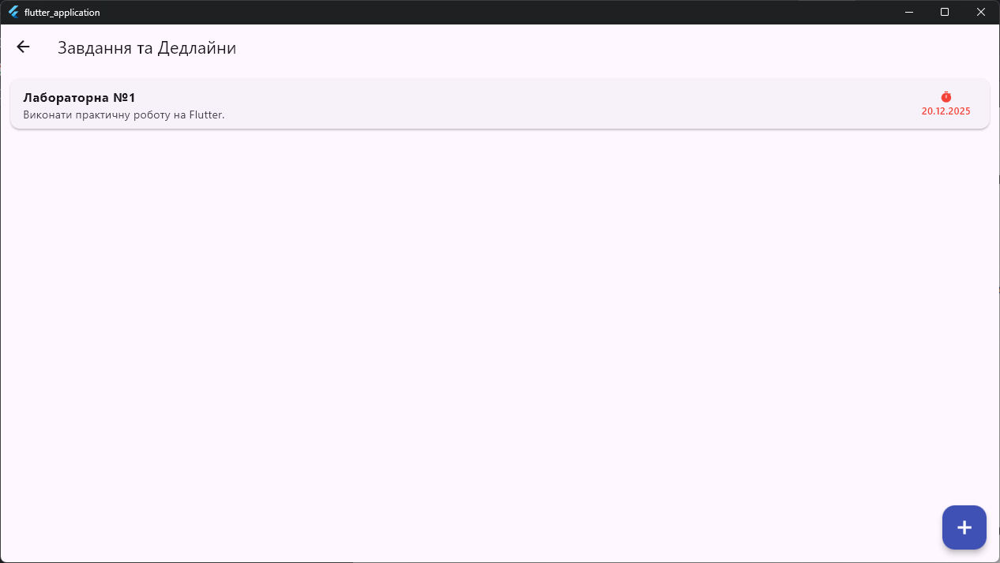
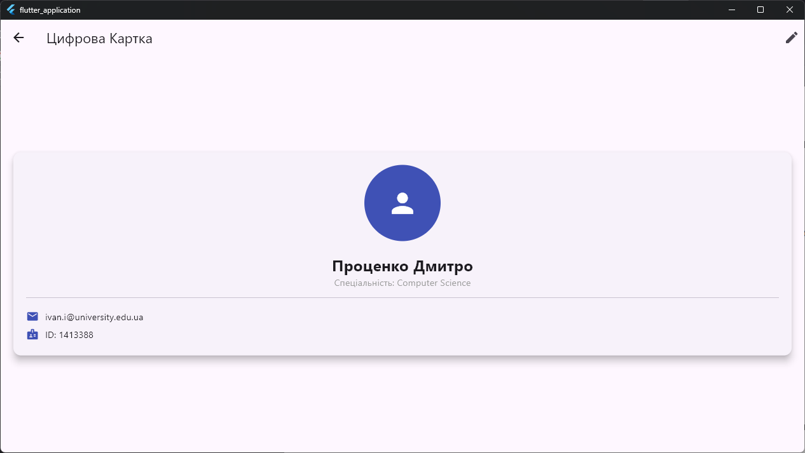

Назва проекту: Student Portal
Опис: Дозволяє зберігати нагадування про різні події та дедлайни. Дозволяє відслідковувати прогрес по стеженню за здоров'ям під час продовжного сидіння за комп'ютером.
Встановлення: Клонуйте програму з репозиторія та запустіть у терміналі команду <flutter run>. Далі оберіть платформу, на якій хочете запустити програму.
Скріншоти:
1. З Windows:

